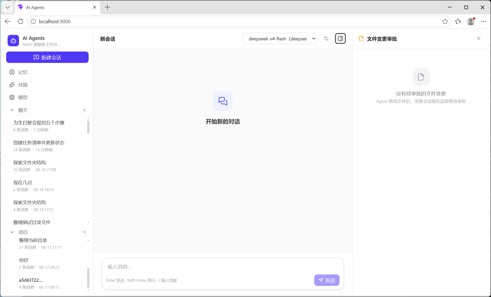

# my-agents

一个基于 ReAct 循环的自托管多工具 AI 助手，支持流式对话、虚拟文件系统审批、跨会话长期记忆、上下文压缩、可拔插skill，可接入任意 OpenAI 兼容的模型服务。

后端使用 FastAPI + SSE 流式响应，前端使用 React + TypeScript + Vite，Agent 通过 OpenAI 兼容接口接入任意模型服务。



## 功能特性

- **ReAct 智能体循环**：自主「思考-调用工具-观察结果」循环，支持上下文压缩、上下文占用监控、迭代/工具调用上限控制与审批。
- **虚拟文件系统（VFS）**：暂存区 + 写时复制 + 操作差分表 + 审批树，AI 的文件改动先纳入审批，用户确认后才真正落盘（详见 [`src/vfs/README.md`](src/vfs/README.md)）。
- **SSE 流式聊天**：全流程流式输出，支持会话标题自动生成、对话取消。
- **多模型管理**：模型配置存于数据库，API Key 通过 `.env` 环境变量管理；支持单模型高级参数（上下文窗口、输出上限、温度、迭代上限、思考模式等）。
- **工具系统**：插件式 self-register 注册，涵盖文件操作（VFS）、网页请求/搜索（Tavily）、代码执行、记忆、子 Agent 委派、待办等。
- **长期记忆**：对话后异步提取关键信息，写入 ChromaDB 向量库，对话开始时按相关性检索注入，支持时间衰减与语义去重。
- **技能（Skills）系统**：`SKILL.md` 驱动的声明式技能，可显式注入上下文、动态加载、在线上传安装、启用/禁用。
- **项目管理**：会话归属项目隔离，工作目录可避免冲突，删除项目级联清理数据。
- **子 Agent 委派**：将子任务委派给独立上下文的子 Agent，仅回传摘要，防止上下文膨胀。

## 技术栈

**后端**
- Python 3.11+，FastAPI，uvicorn（SSE 流式）
- OpenAI SDK（兼容任意 OpenAI 格式模型服务）
- aiosqlite + 连接池、ChromaDB（向量记忆）、Tavily（网页搜索）
- pydantic 数据校验

**前端**
- React 19、TypeScript、Vite
- Tailwind CSS 4、Zustand（状态管理）
- react-router-dom、react-markdown、lucide-react

## 目录结构

```
my-agents/
├── src/                    # 后端源码
│   ├── main.py             # FastAPI 入口与全部 API 路由
│   ├── config.py           # 全局配置（路径、记忆、压缩参数）
│   ├── agent/              # ReAct 循环、上下文压缩、模型配置、提示词
│   ├── tools/              # 工具注册中心与各类工具
│   │   ├── registry.py     # 工具注册表
│   │   ├── loader.py       # 启动时工具 self-register 加载
│   │   ├── vfs_tools.py    # VFS 文件操作工具
│   │   ├── web_tools.py    # web_request / web_search
│   │   ├── execute_tools.py# 命令执行工具
│   │   ├── memory_tools.py # 记忆相关工具
│   │   ├── subagent.py     # 子 Agent 委派工具
│   │   ├── todo_tools.py   # 待办工具
│   │   ├── approval.py     # 工具执行审批
│   │   └── skill_tools.py  # 技能相关工具
│   ├── vfs/                # 虚拟文件系统（详见其 README）
│   ├── memory/             # 长期记忆提取/去重/检索/存储（ChromaDB）
│   ├── session/            # 会话管理、双表持久化、标题生成、取消
│   ├── project/            # 项目隔离（contextvars）、级联清理
│   ├── skills/             # 技能加载与注入
│   ├── models/             # Pydantic 数据模型
│   ├── db/                 # 数据库连接池与建表
│   └── utils/              # 通用工具
├── frontend/               # React 前端
│   └── src/
│       ├── api/            # 后端 API 封装
│       ├── components/     # 聊天 / 布局 / 记忆 / 模型 / 技能 / 审批等组件
│       ├── stores/         # Zustand 状态
│       ├── types/          # 类型定义
│       └── utils/
├── workspace/              # 运行时数据（数据库、记忆、暂存区，gitignore）
└── requirements.txt
```

## 快速开始

### 1. 环境准备

- Python 3.11+
- Node.js 18+

### 2. 一键启动

自动创建虚拟环境、安装依赖、构建前端并启动后端（默认 `http://localhost:8000`）。

**Windows（PowerShell）**

```powershell
.\start.ps1                              # 默认端口 8000
.\start.ps1 -Port 9000                   # 指定端口
# 若执行策略受限，先运行: Set-ExecutionPolicy -Scope Process Bypass
```

**macOS / Linux**

```bash
chmod +x start.sh
./start.sh                               # 默认端口 8000
./start.sh 9000                          # 指定端口
```

脚本内容：创建/复用 `.venv` → `pip install -r requirements.txt` → `cd frontend && npm install && npm run build` → `python -m src.main`。后端在 `frontend/dist` 存在时会优先托管静态资源，直接访问 `http://localhost:8000` 即可。

### 3. 手动启动

若需分步执行或走开发模式，可手动操作：

```bash
# 后端（默认 http://localhost:8000）
python -m venv .venv
source .venv/bin/activate        # Windows: .venv\Scripts\activate
pip install -r requirements.txt
python -m src.main
```

```bash
# 前端
cd frontend
npm install

# 开发模式（默认 http://localhost:5173，/api 代理到 8000）
npm run dev

# 构建生产产物（构建后由后端直接托管）
npm run build
```

### 4. 配置模型

首次使用时，在页面「模型管理」中新增模型，填写名称、Base URL、模型标识与 API Key（Key 会自动写入 `.env`）。未配置模型时聊天接口会提示先添加模型。

## 核心机制

### 工具注册

工具采用「import 即注册（Hermes 模式）」：每个工具模块内通过 `registry.register()` 自注册，应用启动时由 `discover_tools()` 触发所有模块加载。

### VFS 文件审批流

AI 对文件的所有修改都重定向到暂存区并写入差分表，会话结束后构建审批树，用户逐项确认后才真正应用：

```
plan（只读）→ execute（写操作进暂存区）→ merge（合并为最简操作集）→ apply（审批通过后落盘）
```

详见 [`src/vfs/README.md`](src/vfs/README.md)。

### 记忆系统

- **提取**：模型可自主调用工具“记住”某些事。另外，每 N 轮（默认 10）对话后，异步调用模型审阅对话并抽取值得记住的事实。
- **检索**：新对话开始时，基于请求向量化检索 Top-K 相关记忆并注入上下文。
- **去重与衰减**：写入前按余弦距离去重，检索时按时间指数衰减。

详细实现见下方 [长期记忆](#长期记忆) 一节。

### 技能系统

技能以 `SKILL.md` 描述，含 frontmatter（name/description）。可：

- 在对话中显式声明 `[skill:名称]` 触发完整指令注入；
- 在线上传 zip 包安装（含 zip 炸弹安全检查）；
- 通过 API 或界面启用/禁用。

## 模块详解

### Agent 核心（ReAct 循环）

[`src/agent/`](src/agent/) 实现单 Agent 的「思考-调用工具-观察」自主循环，负责与大模型交互、执行工具、监控上下文并处理审批与取消。

**ReAct 循环**
- 每轮迭代调用一次模型（流式），解析 `reasoning_content`（思考过程）与增量 `tool_calls`，聚合后并行执行所有工具，边完成边通过 SSE 推送结果，然后把 `tool` 消息回填上下文进入下一轮。
- 迭代上限、工具调用上限均由模型配置控制；达到上限时暂停并等待用户审批，用户可临时提升上限继续执行。

**SSE 流式事件**：`thinking`（思考过程）/ `token`（可见文本增量）/ `tool_call`（工具调用，含 `requires_approval` 标记）/ `tool_result`（执行结果）/ `threshold_tool_call` 与 `threshold_iteration`（触顶审批）/ `done` / `cancelled` / `error`。最终 `done` 事件携带完整消息列表供调用方持久化。

**上下文占用监控与压缩**（参考 Claude Code 方案）
- 触发阈值：`effective_window = max_context_tokens - max(max_output_tokens, 20000)`，`threshold = effective_window - 13000`。
- 压缩分两阶段：Phase 1 裁剪超大工具输出（>200 字符的 `tool` 消息替换为占位符）；Phase 2 将中间区消息序列化为文本，调用 LLM 生成结构化摘要（历史任务快照 / 目标 / 已完成动作 / 活跃状态 / 阻塞项 / 关键决策 / 相关文件等字段）。
- 头部保护 3 条消息、尾部保留 20% token 预算（至少 5 条），并做边界对齐避免截断 `tool_call` / `tool_result` 对；摘要消息带 `_compaction_summary` 标记，下一轮压缩时剥离并迭代更新。
- 同一会话的 system prompt 在 3 小时 TTL（`SYSTEM_PROMPT_FREEZE_TTL`）内复用首个构建结果。

**取消机制**：`CancelRegistry` 为每个会话维护一个 `asyncio.Event`，流式消费每 10 个 chunk 及每轮迭代开始前检查取消信号，取消时返回已产生的部分结果。

**工具执行**：同一轮的多个工具调用并行执行（`asyncio.as_completed`），工具描述与参数通过工具注册表注入；`execute`、`delegate_task`、`todo` 等工具所需的内部参数（`_cancel_event`、`_model_id`、`_todo_store`）由循环在分发时注入，而非写进工具输入 schema。

**错误处理**：OpenAI SDK 的 `AuthenticationError`、`APITimeoutError`、`APIConnectionError`、`RateLimitError` 等异常统一翻译为中文可读提示。

### 会话与项目

[`src/session/`](src/session/) 与 [`src/project/`](src/project/) 负责会话生命周期与项目隔离。

**会话（Session）**
- 数据模型：`session_id` / `title` / `context_tokens`（上次上下文 token 数，用于压缩检查基线）/ `project_id`（可选归属项目）/ 创建与更新时间 / 消息数。
- 双表持久化：`session_messages` 存展示消息（含完整工具调用与结果，用于前端回放），`context_messages` 存 API 上下文消息（压缩时全量覆盖）。system 消息不持久化，每轮重建。
- 同一会话的读写通过 `asyncio.Lock` 串行化，避免并发覆盖。
- 标题自动生成：首轮对话完成后由 LLM 生成与用户语言一致的简短标题，失败时兜底取用户消息前 20 字。
- 删除会话级联清理两张消息表。
- 子 Agent 消息以 `tool_call_id` 作为 `session_id` 存入 `session_messages`，与父会话隔离且不占用 `sessions` 表。

**项目（Project）**
- 项目是命名的工作目录（`work_dir`），会话可选择性归属；归属后 VFS 文件操作与 `execute` 命令的相对路径均以该工作目录为基准自动解析。
- 项目上下文通过 `contextvars` 在协程级隔离，`subagent` 经 `asyncio.create_task` 自动继承当前项目，并发会话互不干扰。
- 删除项目在单个事务内级联删除其全部会话（含消息、上下文消息与 VFS 各表记录），并返回被删会话 ID 供调用方清理磁盘资源（system prompt 缓存、暂存区文件）。
- 项目列表带会话数统计，按创建时间倒序。

### 长期记忆

[`src/memory/`](src/memory/) 提供基于 ChromaDB 的跨会话长期记忆。

- **提取**：对话每满 N 轮（默认 10）后，fire-and-forget 调用 LLM（temperature=0）审阅完整对话，提取两类记忆：`preference`（用户偏好/习惯，必须带 `key`，如 `language`、`response_style`）与 `semantic`（关于用户及世界的客观事实）。模型返回 JSON 数组，经校验清洗后写入。
- **存储**：ChromaDB `PersistentClient`，collection 名 `memories`，使用默认 embedding 函数与 cosine 距离空间；每条记忆记录 `memory_type`、`key`、`session_id`、`created_at` 元数据。
- **写入去重**：写入前查询同类型最相似的已有记忆，余弦距离 ≤ 0.2（`MEMORY_DEDUP_THRESHOLD`）时跳过，避免重复沉淀。
- **检索**：先取 2 倍候选，按时间指数衰减重排 `final_score = similarity × e^(-λ×days)`（λ 默认 0.05），再取 Top-K（默认 5）返回。
- **注入**：`preference` 类记忆静态注入 system prompt（「用户偏好（始终遵循）」区块，始终生效）；`semantic` 类记忆在每轮对话开始时按用户 query 动态检索，注入 user message 作为补充信息。
- **管理**：支持分页列表（按类型过滤）、更新（重新 embedding）、删除与计数统计，并通过 `/api/memories` 对外提供管理接口。
- **配置项**：提取间隔、提取/检索开关、最大结果数、去重阈值、衰减系数均可在 [`src/config.py`](src/config.py) 调整。

## API 一览

后端将 API 与静态资源统一托管在 FastAPI，主要分组：

| 分组 | 说明 |
|------|------|
| `/api/chat/stream` | SSE 流式对话；`/api/chat/cancel/{id}` 取消 |
| `/api/sessions` | 会话的列表 / 删除 / 标题 / 消息 / 子 Agent 历史 |
| `/api/projects` | 项目创建 / 更新 / 删除 |
| `/api/models` | 模型配置增删改查 |
| `/api/memories` | 记忆列表 / 更新 / 删除 / 统计 |
| `/api/skills` | 技能列表 / 启停 / 上传安装 |
| `/api/vfs/review/{task}` | VFS 审批树获取与审批处理 |
| `/api/tools/decide/{sid}/{tool_call_id}` | 工具执行审批决策 |
