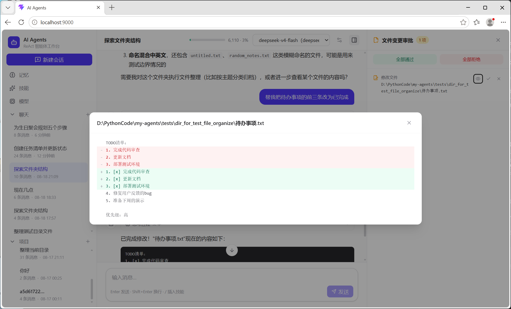

# VFS (Virtual File System) 模块

VFS 模块为 AI 操作文件提供了一套**虚拟文件系统**机制。它通过**暂存区（Staging Area）**、**写时复制（Copy-on-Write）**、**操作差分表（Diff Table）** 和**审批（Review）**，让 AI 可以在不直接修改原始文件系统的情况下，安全地规划和修改文件，最终由用户审核**最简操作集**后才真正落盘。



## 核心概念

所有对文件/目录的修改操作不会直接作用到原始文件系统，而是被重定向到暂存区；同时每一步操作记录到差分表。任务结束后，差分记录被合并为最简操作集并生成审批树，用户逐条或整体审批通过后才执行真实文件操作。

整体生命周期分为三个阶段：

1. **execute 阶段**：AI 调用 VFS 工具，写操作重定向到暂存区，操作记录写入差分表（`diff_records`）
2. **review 阶段**：差分记录合并（`merge`）为最简操作集，构建审批树持久化到 `review_items`，随对话 `done` 事件下发前端；用户可预览每个文件的变更前/后内容与行级 diff
3. **apply 阶段**：用户审批（通过/拒绝），通过的操作执行真实文件系统操作并清理 VFS 状态；拒绝的操作仅清理 VFS 状态

> **task_id 即 session_id**：当前实现中，一个对话会话就是一个 VFS 任务，两者的生命周期绑定。

## 模块组成

### 1. `task_context.py` —— 任务上下文与 VFS 实例注册表

基于 `contextvars` 实现**协程级**的 task_id 隔离，支持多个会话并发执行互不干扰；并通过注册表管理每个 task 独立的 VFS 实例。

**task_id 上下文：**
- `set_current_task_id(task_id)`：绑定当前协程的 task_id（已绑定不同 task_id 时报错）
- `get_current_task_id()`：获取当前 task_id，未设置时抛异常
- `get_task_id_with_no_error()`：获取 task_id，未设置返回 None
- `clean_current_task_id()`：清理 task_id

**VFS 实例生命周期（引用计数）：**
- `init_vfs(task_id)`：创建并加载该 task 的 `StagingArea` / `CopyMapping`；已存在则引用计数 +1
- `get_staging_area()` / `get_copy_mapping()`：获取当前协程对应 task 的实例（未初始化时抛异常）
- `get_vfs_lock()`：获取该 task 的写操作锁（`asyncio.Lock`），保证同一 task 内写操作的并发安全
- `clean_vfs()`：引用计数 -1，降为 0 时才真正清理实例缓存和锁

### 2. `staging_area.py` —— 暂存区管理

核心暂存区机制。**每个 task 一个实例**，维护路径到暂存区路径的映射。所有写数据库的方法都接收外部注入的 `_conn`，与调用方保持同一事务。

**缓存结构：**
- `mapping`：`{原始路径 -> 暂存区真实路径}` 映射表
- `deleted_mapping`：文件删除标记表
- `deleted_dir_mapping`：目录删除标记表

**主要方法：**
- `register(path)`：为文件分配暂存区路径（`{STAGING_AREA_PATH}/{task_id}/{md5(path)}{扩展名}`，哈希文件名避免路径中的 `/` 导致额外建目录）
- `register_dir(path)`：为目录注册占位（`staging_path = " "`，**不实际创建目录**，避免产生大量空目录）
- `delete(path)` / `delete_dir(path)`：标记删除。目录删除会级联标记其下所有已注册子文件/子目录
- `rename(old, new)` / `rename_dir(old, new)`：更新路径映射。目录重命名会级联更新所有子路径（缓存与数据库双重更新）
- `get_staging_path(path)` / `get_staging_dir_path(path)`：获取暂存区路径，已删除或不存在返回 None
- `is_deleted(path)` / `is_deleted_dir(path)`：判断是否在暂存区内被删除
- `load()` / `clear()`：从数据库加载 / 清空缓存

> `deleted` 标记的意义：文件在暂存区被删除后，真实磁盘上它仍然存在。此时若想在同路径重新创建文件，若不标记删除，会因磁盘文件存在而误报命名冲突。标记后命名冲突检查会跳过磁盘判断。

### 3. `copy_mapping.py` —— 写时复制映射

实现 **Copy-on-Write**。文件被复制或移动时不立即拷贝内容，只注册复制记录；只有当源文件后续发生修改或删除时，才真正执行拷贝。**每个 task 一个实例**，持有同 task 的 `StagingArea` 引用。

**缓存结构：**
- `registered_num` / `copied_num`：源路径被注册复制 / 已实际拷贝的次数（支持一源多目标）
- `dir_mapping`：目录复制映射 `{source_dir -> target_dir}`
- `dir_copy_done`：目录复制中已完成拷贝的子文件
- `file_reverse` / `dir_reverse`：**反向映射**（target → source），供审批阶段反查 copy/move 的原始来源

**主要方法：**
- `register(source, target)` / `register_dir(source, target)`：注册文件/目录复制记录
- `need_copied(path)` / `need_copied_dir(path)`：判断源是否还有未完成的拷贝（含目录前缀统计）
- `mark_copied(path)` / `mark_copied_dir(path)`：执行拷贝并标记完成。拷贝时优先使用源文件的暂存区版本（源已被改过则拷暂存区内容）
- `copy_if_need(target_path)`：按目标路径判断是否需要拷贝（审批阶段补拷贝）
- `rename(old, new)` / `rename_dir(old, new)`：同步更新映射中的路径（含前缀替换）
- `get_copy_source(path)`：根据目标路径反查原始来源路径（精确匹配 → 目录前缀匹配），非 copy/move 产物返回 None
- `load()` / `clear()`：从数据库加载 / 清空缓存

**典型场景——`move_file`：**
1. 注册复制记录（`source -> target`）
2. 在暂存区标记 `source` 为已删除
3. 在暂存区为 `target` 分配路径
4. 后续 `source` 若被修改/删除，触发实际文件拷贝（保证 target 有完整内容）

### 4. `operations.py` —— 文件操作入口

AI 工具直接调用的文件/目录操作函数。每个写操作的固定套路：

1. `_resolve_path()` 路径解析：相对路径拼接当前项目工作目录（关联了项目时），绝对路径原样返回
2. 路径合法性检查（命名冲突、存在性、同目录约束等）
3. 在暂存区注册/更新路径映射
4. 检查并触发写时复制
5. 写入操作记录到差分表

所有写操作都在 **`get_vfs_lock()` + 数据库连接事务** 中执行，保证同一 task 内的串行一致。

支持的操作：

| 操作 | 说明 |
|------|------|
| `list_dir(path)` | 列出目录内容（合并真实文件系统 + 暂存区，排除已删除项） |
| `read_file(path)` | 读取文件内容（暂存区优先于磁盘） |
| `create_file(path, content)` | 在暂存区创建文件（同路径被删除后允许重建） |
| `delete_file(path)` | 在暂存区标记删除（触发写时复制检查） |
| `rename_file(src, dst)` | 重命名文件（**仅同目录**，跨目录报错） |
| `modify_file(path, new_str, replace, old_str)` | 修改文件内容，两种模式见下 |
| `copy_file(src, dst)` | 复制文件（写时复制；源必须真实存在于磁盘） |
| `move_file(src, dst)` | 移动文件（= 复制注册 + 源删除标记） |
| `mkdir(path)` | 创建空目录（暂存区占位） |
| `delete_dir(path)` | 删除目录（级联标记子项；触发目录写时复制） |
| `rename_dir(src, dst)` | 重命名目录（**仅同目录**；级联更新子路径映射） |
| `copy_dir(src, dst)` | 复制目录（递归展开子项的 MKDIR/CREATE_FILE 记录） |
| `move_dir(src, dst)` | 移动目录（复制注册 + 源目录删除标记 + 递归展开子项记录） |

**`modify_file` 的两种模式：**
- **全量覆盖**（`replace=False`）：`new_str` 为完整新内容，直接覆盖暂存区文件
- **SEARCH/REPLACE**（`replace=True`）：在文件中查找 `old_str` 并替换为 `new_str`；要求 `old_str` 在文件中**唯一匹配**（找不到或出现多次均报错）

**重要约束：**
- `copy_file` / `move_file` / `copy_dir` / `move_dir` 的**源路径必须真实存在于磁盘**——禁止以虚拟路径（暂存区中新建的文件）作为复制/移动的源
- 首次修改一个磁盘文件时，会先把它拷贝进暂存区再修改（`register` + `copy`）

### 5. `diff_table.py` —— 操作差分表与合并

记录所有操作并生成可审核的最简操作集。

**数据结构：**
- `OperationType`：操作类型枚举
  - 文件级：`CREATE_FILE`, `DELETE_FILE`, `RENAME_FILE`, `MODIFY_FILE`
  - 目录级：`MKDIR`, `DELETE_DIR`, `RENAME_DIR`
- `DiffRecord`：单条操作记录（`task_id`, `operation_type`, `source_path`, `target_path`, `step`, `created_at`）
- `OperationTree`：最简操作集的树（`path`, `dir_operation`, `sub_groups`, `file_operations`）

**存储与查询（均为静态方法）：**
- `operate(record)` / `operate_batch(records)`：写入操作记录。写入时即做**链式重命名合并**：
  - `RENAME_FILE`：已有 `a->b`，本次 `b->c`，则更新为 `a->c`，并把之后引用 `b` 的记录同步改为 `c`
  - `RENAME_DIR`：把已有记录中所有以 `source_path` 为前缀的路径替换为 `target_path`；已有同源 rename 记录则只更新 target
- `list(task_id)`：查询该 task 所有**未审批**（`is_reviewed = 0`）的记录，按时间升序
- `has_unreviewed(task_id)`：是否存在未审批记录
- `mark_reviewed(task_id)`：将所有未审批记录标记为已审批

#### 合并算法（`merge`）

将操作记录列表合并为最简操作集的 `OperationTree`：

**Step 1：反向遍历 + 路径映射**
- 从后向前遍历，遇到重命名操作建立 `old -> new` 路径映射（含链式重命名折叠）
- 将映射应用到位于它**之前**的操作记录上（实现重命名对历史操作路径的追溯）

**Step 2：按目录结构分组（两遍遍历）**
- 第一遍：提取目录级操作（MKDIR/DELETE_DIR/RENAME_DIR），动态构建 `DirGroup` 树（自动挂到最近的已存在父组，必要时收养孤儿子节点）
- 第二遍：文件级操作按所属目录组划分（`RENAME_FILE` 按 target_path 分组，其余按 source_path）

**Step 3：递归构建操作树（`_build_operation_tree`）**
- 目录级合并：处理"创建后删除"（当前层禁用，子操作上浮）、上级 `DELETE_DIR` 对子操作的抵消（通过 `delete_index` 下标传递）
- 文件级合并：
  - 首个操作为 `CREATE_FILE`（新文件）：只看最后一个操作——是 `DELETE_FILE` 或发生在 `DELETE_DIR` 之后则整体抵消，否则保留 `CREATE_FILE`
  - 原已存在的文件：按 `_match` 规则遍历合并；首条 `RENAME_FILE` 作为附加操作保留；若最终为 `DELETE_FILE` 且有 rename，把 source_path 还原为最初路径

#### 合并规则（`_match`）

目录级：

| 前操作 | 后操作 | 合并结果 |
|--------|--------|----------|
| None | 任意 | 后操作 |
| MKDIR | RENAME_DIR | MKDIR（以最终路径为准） |
| MKDIR | DELETE_DIR | 取消（相互抵消） |
| DELETE_DIR | MKDIR | 取消（先删后建 = 修改） |
| RENAME_DIR | DELETE_DIR | DELETE_DIR |

文件级（仅适用于原已存在的文件）：

| 前操作 | 后操作 | 合并结果 |
|--------|--------|----------|
| None | DELETE_FILE / MODIFY_FILE | 后操作 |
| DELETE_FILE | CREATE_FILE | MODIFY_FILE |
| MODIFY_FILE | DELETE_FILE | DELETE_FILE |
| MODIFY_FILE | MODIFY_FILE | MODIFY_FILE |

### 6. `review_manager.py` —— 审批管理器

负责任务结束后的审批流程：

- 将 merge 结果构建为**前端树形结构**，同时持久化到 `review_items` 表（先清掉旧的 pending 项避免重复）
- 返回审批列表给前端（支持页面刷新后重新获取）
- 读取审批项的变更前/后内容与 diff 供预览
- 处理审批（通过/拒绝），执行真实文件操作并清理 VFS 状态

**主要方法：**
- `build_review_tree(task_id)`：`list` 未审批记录 → `merge` → 遍历 `OperationTree` 同时产出前端树和 DB 行（目录操作为父节点，文件操作挂在其下）；为 `CREATE_FILE` 项通过 `copy_mapping.get_copy_source()` 补充 `copy_source` 字段。全部抵消时直接标记已审批并返回 None
- `get_review_tree(task_id)`：从 `review_items` 表按 `parent_id` 重建树（页面刷新场景）
- `get_item_content(task_id, item_id)`：读取审批项内容。**审批前磁盘文件 = 变更前内容（before），暂存区文件 = 变更后内容（after）**；`MODIFY_FILE` 额外生成行级结构化 diff（same/add/del）供前端高亮
- `process_review(task_id, approved)`：整体通过/拒绝，逐条调用 `process_single_item`
- `process_single_item(task_id, item_id, approved)`：单条审批核心逻辑（见下）

**单条审批的处理逻辑：**

*通过（approved=True）：*
1. **级联通过父级**：递归执行父目录操作链（祖先先执行），保证父目录存在
2. **关联 rename 先行**：若存在 `target == source` 的 `RENAME_FILE` 记录，先执行该重命名
3. **写时复制检查**（`_do_write_copy_checks`）：
   - `CREATE_FILE`/`MODIFY_FILE` → `copy_if_need`（把源内容补拷到暂存区目标）
   - `MODIFY_FILE`/`DELETE_FILE` → 源有未完成拷贝则 `mark_copied`
   - `DELETE_DIR` → `mark_copied_dir`
4. **执行真实文件操作**（`_apply_operation`）：
   - MKDIR → `os.makedirs`；CREATE_FILE/MODIFY_FILE → 暂存区文件拷回磁盘（自动建父目录）；DELETE_FILE → `os.remove`；RENAME_FILE/RENAME_DIR → `os.rename`（自动建目标父目录）；DELETE_DIR → `shutil.rmtree`
5. **清理 VFS 状态**（`_clean_vfs_state`）：标记相关 `diff_records` 已审批、删除 `copy_records`/`staging_records` 记录、删除暂存区磁盘文件

*拒绝（approved=False）：*
- 目录操作（MKDIR/RENAME_DIR/DELETE_DIR）**级联拒绝所有子孙操作**（不执行 apply，仅清理 VFS + 标记 rejected）
- `RENAME_FILE`/`RENAME_DIR` 拒绝时**反向回退**：把 `staging_area`/`copy_mapping` 中的路径映射 rename 回原值，`diff_records` 中后续引用同步回退，保证后续审批不受影响

### 7. `conflict_merge_plan.md` —— 跨任务冲突合并方案（规划中）

两个不同 task 对同一文件操作并先后 apply 时的冲突检测与三路合并（base/ours/theirs，基于 `merge3` 库）设计文档。**尚未实现**，当前仅覆盖 `MODIFY_FILE` vs `MODIFY_FILE` 场景的方案设计。

## 工具注册（`src/tools/vfs_tools.py`）

VFS 操作通过工具注册表（Hermes 模式：schema + handler 同文件）暴露给 AI，共 13 个工具：`list_dir`, `read_file`, `create_file`, `delete_file`, `rename_file`, `modify_file`, `copy_file`, `move_file`, `mkdir`, `delete_dir`, `rename_dir`, `copy_dir`, `move_dir`。

工具的路径参数统一支持**绝对路径或相对于项目工作目录的相对路径**。

> 配套约束：`execute` 工具（命令执行）已对文件系统命令（rm/del/mv/cp/mkdir/ls/dir 等）做了黑名单拦截，引导 AI 使用 VFS 工具，防止绕过暂存区直接改磁盘。

## 外部接入（`src/main.py`）

**对话流（`_stream_events`）：**

```
set_current_task_id(session_id)
init_vfs(session_id)                # 引用计数 +1
  ↓ AI 执行（VFS 工具写操作进暂存区/差分表）
  ↓ done/cancelled 事件时：
      DiffTable.has_unreviewed(session_id)
        → ReviewManager.build_review_tree(session_id)
          → 有变更则把 review_tree 嵌入 done 事件下发给前端
finally:
  clean_vfs()                       # 引用计数 -1，降为 0 清理缓存（数据库记录保留待审批）
  clean_current_task_id()
```

**API 端点：**

| 方法 | 路径 | 说明 |
|------|------|------|
| GET | `/api/vfs/review/{task_id}` | 获取审批树（页面刷新重建） |
| POST | `/api/vfs/review/{task_id}?approved=` | 整体通过/拒绝 |
| POST | `/api/vfs/review/{task_id}/item/{item_id}?approved=` | 审批单条操作 |
| GET | `/api/vfs/review/{task_id}/item/{item_id}/content` | 预览变更内容（before/after/diff） |

审批接口内部都会先 `set_current_task_id` + `init_vfs`，处理完毕后 `clean_vfs` + `clean_current_task_id`。

## 数据流示例

以一次文件整理会话为例（`task_id = session_id`）：

```
对话阶段（execute）:
  list_dir("/test_dir")                 -> 合并暂存区与磁盘视图
  read_file("/test_dir/笔记.txt")        -> 读取内容分析
  mkdir("/test_dir/life")               -> staging_area.register_dir() + diff: MKDIR
  move_file("/test_dir/健身记录.txt", "/test_dir/life/健身记录.txt")
    -> copy_mapping.register(源, 目标)          # 写时复制注册
    -> staging_area.delete(源) + register(目标)  # 暂存区映射
    -> diff: [CREATE_FILE(目标), DELETE_FILE(源)]
  ...
  done 事件 -> build_review_tree() -> 前端收到审批树

审批阶段（review/apply）:
  GET  /api/vfs/review/{task_id}/item/{id}/content   -> 预览 before/after/diff
  POST /api/vfs/review/{task_id}?approved=true
    -> 逐条: 级联父级 -> 写时复制检查 -> 真实文件操作 -> 清理 VFS 状态
```

审批树结构示例：

```json
{
  "task_id": "d43a4891-...",
  "items": [
    {
      "id": "uuid", "op_type": "MKDIR", "source": "/test_dir/life",
      "target": "", "copy_source": "", "status": "pending",
      "children": [
        { "id": "uuid", "op_type": "CREATE_FILE", "source": "/test_dir/life/健身记录.txt",
          "copy_source": "/test_dir/健身记录.txt", "status": "pending" }
      ]
    },
    { "id": "uuid", "op_type": "DELETE_FILE", "source": "/test_dir/旅行计划.txt", "status": "pending" }
  ]
}
```

## 数据库表说明

VFS 模块使用四个核心数据库表：

| 表 | 用途 | 关键字段 |
|----|------|----------|
| `staging_records` | 暂存区路径映射 | `task_id`, `path`, `staging_path`, `is_dir`, `deleted` |
| `copy_records` | 写时复制记录 | `task_id`, `source_path`, `target_path`, `is_copied`, `is_dir` |
| `diff_records` | 操作差分记录 | `task_id`, `operation_type`, `source_path`, `target_path`, `step`, `is_reviewed` |
| `review_items` | 审批项（merge 产物） | `id`(uuid), `task_id`, `parent_id`, `op_type`, `source`, `target`, `copy_source`, `status`(pending/approved/rejected) |

- `diff_records.is_reviewed`：区分未审批/已审批记录，`list()` 只取未审批的
- `review_items.parent_id`：构建前端树形结构的父子关系（目录操作为父节点）
- `review_items.status`：`pending` → `approved`/`rejected`，整体审批会先删除旧的 pending 项重建
